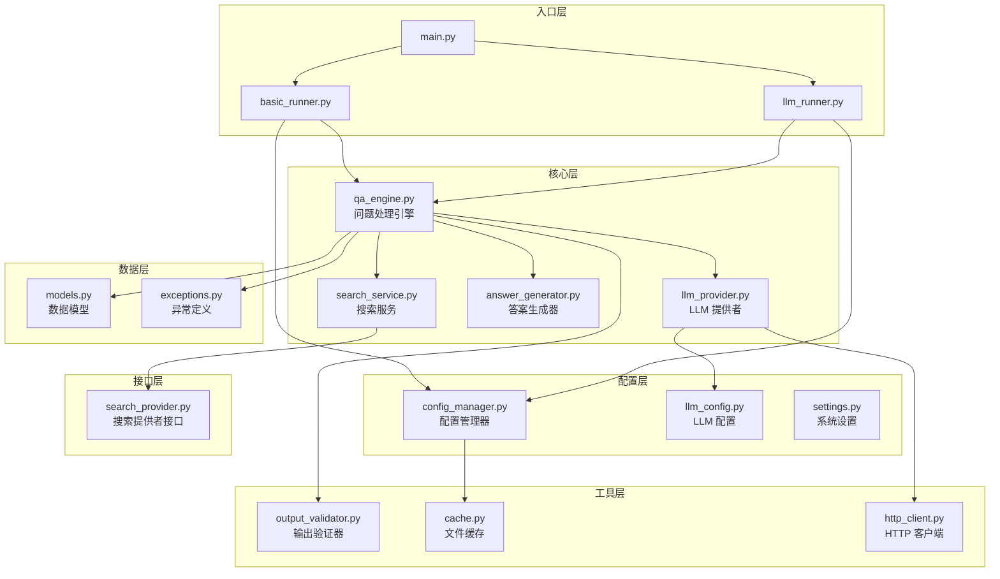
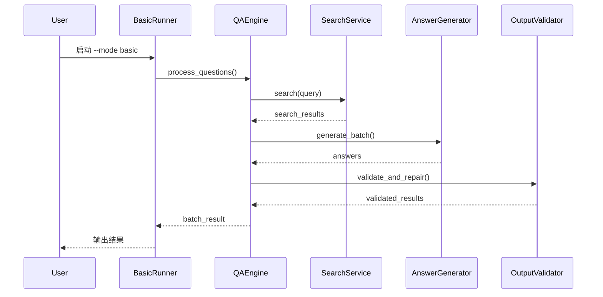
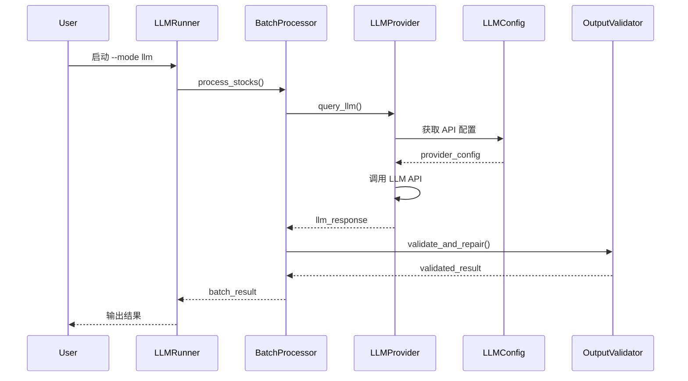

# StockQAbyLLM 架构文档

## 系统概述

StockQAbyLLM 是一个基于大语言模型的股票问题问答系统，支持基础模式（搜索引擎）和 LLM 模式（AI 生成答案）。

## 系统架构



## 模块职责

### 入口层 (src/runners/)

| 模块 | 职责 |
|------|------|
| `basic_runner.py` | 基础模式运行器，使用搜索引擎获取答案 |
| `llm_runner.py` | LLM 模式运行器，使用 AI 生成答案 |
| `batch_processor.py` | 批量问题处理器，支持并发处理 |

### 核心层 (src/core/, src/services/, src/providers/)

| 模块 | 职责 |
|------|------|
| `qa_engine.py` | 问题处理引擎，协调整个问答流程 |
| `search_service.py` | 搜索服务，封装多种搜索引擎 |
| `answer_generator.py` | 答案生成器，从搜索结果生成答案 |
| `llm_provider.py` | LLM 提供者，管理多个 LLM API |

### 配置层 (src/config/)

| 模块 | 职责 |
|------|------|
| `config_manager.py` | 配置管理器，加载问题配置文件 |
| `json_config_manager.py` | JSON 配置管理器，支持多种格式 |
| `llm_config.py` | LLM 配置管理器，管理 LLM API 配置 |
| `settings.py` | 系统设置，定义全局常量和配置 |

### 工具层 (src/utils/)

| 模块 | 职责 |
|------|------|
| `output_validator.py` | 输出验证器，验证和修复输出结果 |
| `cache.py` | 文件缓存，减少重复文件 I/O |
| `http_client.py` | HTTP 客户端，提供连接池和重试 |
| `logger.py` | 日志工具，统一的日志接口 |

### 数据层 (src/core/)

| 模块 | 职责 |
|------|------|
| `models.py` | 数据模型，定义核心数据结构 |
| `exceptions.py` | 异常定义，自定义异常类 |

### 接口层 (src/interfaces/)

| 模块 | 职责 |
|------|------|
| `search_provider.py` | 搜索提供者接口，定义搜索服务契约 |

## 数据流

### 基础模式流程



### LLM 模式流程



## 设计模式

### 1. 策略模式 (Strategy Pattern)

**位置**: `src/interfaces/search_provider.py`

允许在运行时切换不同的搜索引擎实现。

```python
class SearchProvider(ABC):
    @abstractmethod
    def search(self, query: str) -> List[Dict[str, Any]]:
        pass
```

### 2. 工厂模式 (Factory Pattern)

**位置**: `src/providers/llm_provider.py`

根据配置创建不同的 LLM 提供者实例。

### 3. 仓储模式 (Repository Pattern)

**位置**: `src/config/config_manager.py`

封装配置数据的访问逻辑。

### 4. 外观模式 (Facade Pattern)

**位置**: `src/core/qa_engine.py`

为复杂的问答流程提供简单的接口。

### 5. 模板方法模式 (Template Method Pattern)

**位置**: `src/config/config_provider.py`

定义配置加载的骨架，子类实现具体细节。

### 6. 建造者模式 (Builder Pattern)

**位置**: `src/core/models.py`

使用 dataclass 简化对象构建。

## 核心概念

### 问题处理流程

1. **加载配置**: 从配置文件读取问题列表
2. **验证问题**: 检查问题格式和内容
3. **搜索/生成**: 获取答案（基础模式用搜索引擎，LLM 模式用 AI）
4. **验证输出**: 检查答案完整性和格式
5. **修复输出**: 自动修复缺失或不完整的答案
6. **保存结果**: 将结果保存到文件或输出到控制台

### 配置管理

系统支持多种配置格式：

- **TXT 格式**: 简单的文本文件，每行一个问题
- **JSON 格式**: 结构化配置，支持分类和元数据

### 错误处理

- **自定义异常**: 继承自 `StockQAError`
- **异常链**: 使用 `raise ... from e` 保留原始错误
- **日志记录**: 所有错误都被记录到日志文件

### 批量处理

支持两种批量处理模式：

1. **串行模式**: 逐个处理问题
2. **并行模式**: 使用异步 API 并发处理

## 性能优化

### 1. 文件缓存

使用 `FileCache` 类缓存配置文件读取，减少 I/O 操作。

### 2. 连接池

使用 `HTTPClient` 管理的连接池，复用 HTTP 连接。

### 3. 异步 API

支持使用 `AsyncLLMProvider` 进行异步 API 调用。

### 4. 批量处理

`BatchProcessor` 支持批量处理问题，减少 API 调用开销。

## 扩展性

### 添加新的搜索引擎

1. 实现 `SearchProvider` 接口
2. 在 `SearchService` 中注册新提供者

### 添加新的 LLM 提供者

1. 在 `llm_apis.json` 中添加配置
2. 确保符合配置格式规范

### 添加新的输出格式

1. 在 `models.py` 中定义新的数据模型
2. 更新 `output_results` 方法

## 安全考虑

1. **API 密钥**: 使用环境变量存储敏感信息
2. **输入验证**: 验证所有用户输入
3. **错误处理**: 不暴露敏感信息在错误消息中
4. **日志脱敏**: API 密钥在日志中自动脱敏

## 测试架构

```
tests/
├── unit/              # 单元测试
│   ├── test_config_manager.py
│   ├── test_llm_provider.py
│   └── ...
├── integration/       # 集成测试
│   ├── test_qa_pipeline.py
│   ├── test_json_config.py
│   └── ...
└── fixtures/          # 测试夹具
    └── conftest.py
```

## 部署架构

### 开发环境

- Python 3.9+
- 虚拟环境
- 本地配置文件

### 生产环境

- Docker 容器化（待实现）
- 环境变量配置
- 日志轮转
- 错误监控（待实现）

---

*文档版本: 1.0*
*最后更新: 2026-02-09*
